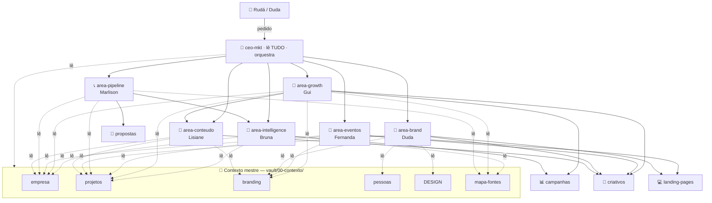

# 🗺️ Mapa de Agentes × Contexto (3 camadas)

> Atualizado 31/mai/2026. O escritório agora espelha a organização por ÁREA/DONA. 3 camadas: CEO orquestra → 6 agentes de área (1 por dona) → 4 executores transversais. Ver tela viva em `/agentes` no Office.

## Arquitetura

## Camadas

### 🎯 Orquestrador
- **ceo-mkt** — lê o mestre todo, decompõe pedidos, delega pra área dona ou executor, consolida.

### 🏢 Agentes de área (1 por dona) — donos do contexto da área
| Agente | Dona | Lê | Módulo | Aciona |
|---|---|---|---|---|
| `area-intelligence` | Bruna | empresa·projetos·mapa-fontes | `/area/intelligence` | campanhas |
| `area-growth` | Gui | empresa·projetos·branding·mapa-fontes | `/area/growth` | campanhas·criativos·conteúdo |
| `area-eventos` | Fernanda | empresa·projetos·branding | `/area/eventos` | criativos·LPs |
| `area-pipeline` | Marlison | empresa·projetos·mapa-fontes | `/area/pipeline` | propostas·intelligence |
| `area-brand` | Duda | branding·pessoas·DESIGN·projetos | `/area/brand` | criativos·LPs |
| `area-conteudo` | Lisiane | branding·empresa·projetos | `/area/conteudo` | criativos |

### 🛠️ Executores transversais (chamados pelas áreas)
`criativos` · `landing-pages` · `propostas` · `campanhas` — cada um com seu escopo (ver `.claude/agents/<nome>.md`).

## Princípio (Regra 9 estendida aos agentes)
1 fonte mestre · cada agente declara seu escopo · subagente abre fresco (herda só o que o CEO/área passa + sua fatia) → menos token, menos alucinação cruzada. CEO = única visão global.

Ver: [[_index]] · perfis em `vault/agentes/` · definições em `.claude/agents/`.
