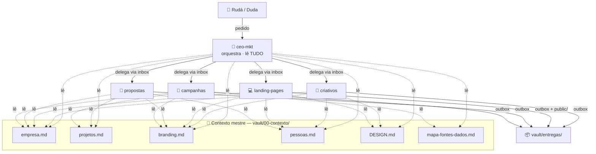

# 🗺️ Mapa de Agentes × Contexto

> Como o contexto mestre (`vault/00-contexto/`) se divide entre os agentes. Cada especialista lê SÓ sua fatia; o CEO orquestra e tem visão do todo. Atualizado 31/mai/2026.

## Arquitetura (quem chama quem)

## Tabela de escopo

| Agente | Lê do mestre | NÃO lê | Workspace |
|---|---|---|---|
| 🎯 **ceo-mkt** | **tudo** (empresa·projetos·branding·pessoas·DESIGN·mapa-fontes) | — | `workspaces/ceo/` |
| 🎨 **criativos** | branding · empresa · pessoas · DESIGN | pipeline, metas $, propostas | `workspaces/criativos/` |
| 💻 **landing-pages** | branding · DESIGN · empresa · pessoas | pipeline, propostas, mídia | `workspaces/landing-pages/` |
| 📄 **propostas** | empresa · projetos · pessoas · branding | design tokens, criativos, mídia | `workspaces/propostas/` |
| 📣 **campanhas** | empresa · projetos · branding · mapa-fontes | propostas, código LP, design | `workspaces/campanhas/` |

## Princípio (Regra 9 estendida aos agentes)

- **1 fonte mestre** (`vault/00-contexto/`) — verdade única, sem duplicar.
- **Cada agente declara seu escopo** no próprio `.claude/agents/<nome>.md` (seção "🧭 Escopo de contexto").
- **Subagente abre fresco** — herda só o que o CEO passa no inbox + sua fatia do mestre. Não carrega contexto de outro agente → menos token, menos alucinação cruzada.
- **CEO é o único com visão global** — ele decompõe e distribui.

Ver também: [[_index]] · cada perfil em `vault/agentes/<nome>.md`.
